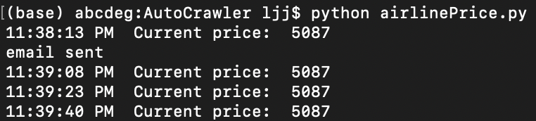

# Airline Price Change Detector With E-mail Notification
Recently, I am planning to take a trip to Singapore. However, airplane ticket is expensive for me. 

I know that the airplane ticket price will change occasionally. But I don't have that time to monitor it since I need to take online courses and prepare for my final exam.

As a result, I develop this Price Change Detector in order to help me monitor the price.

## Function
Each time the airplane price changes, it will send me a E-mail as reminder.

## Ideas and Steps

1. Using Selenium WebDriver to open this airplane webpage
2. Using CSS selector to get the text of the price
3. if the price changes, send a e-mail.

## Usage
```python
python airlinePrice.py
```

## Sample Result
 

## Technology Stack and References
- Python 3
- [Selenium](https://www.selenium.dev/)
- [Gmail Smtp](https://gist.github.com/yzhong52/d703ec82aeee24164f0c)
- [Xiamen AIR Airplane Price API](https://www.xiamenair.com/zh-cn/home.html)

## Maintenance
- Want to change a website, just change link of Line 17
- Want to change a target, just change css selector of line 18

## Future Work
- [Twilio Phone Call](https://www.twilio.com/docs/voice/quickstart/python#install-python-and-the-twilio-helper-library)
